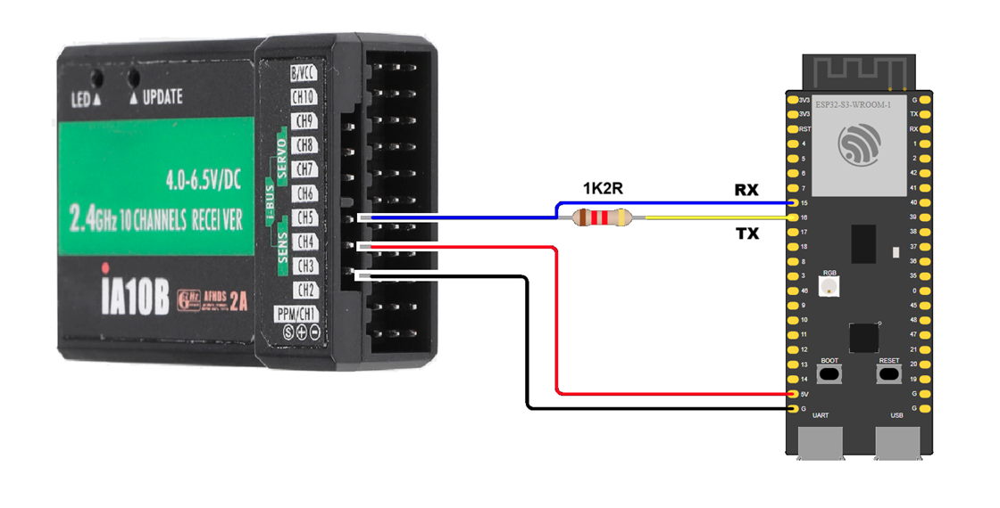
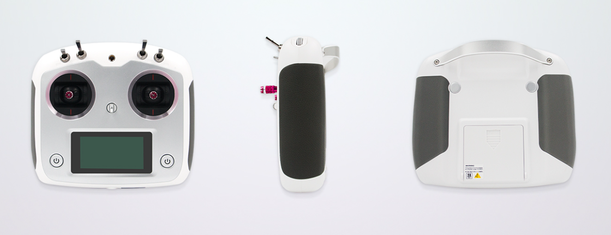
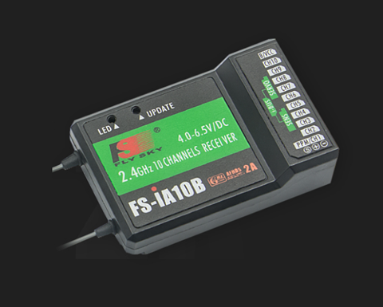
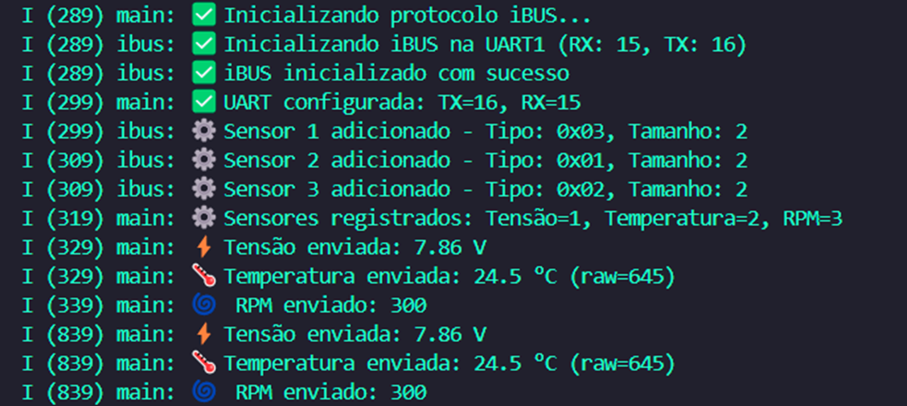
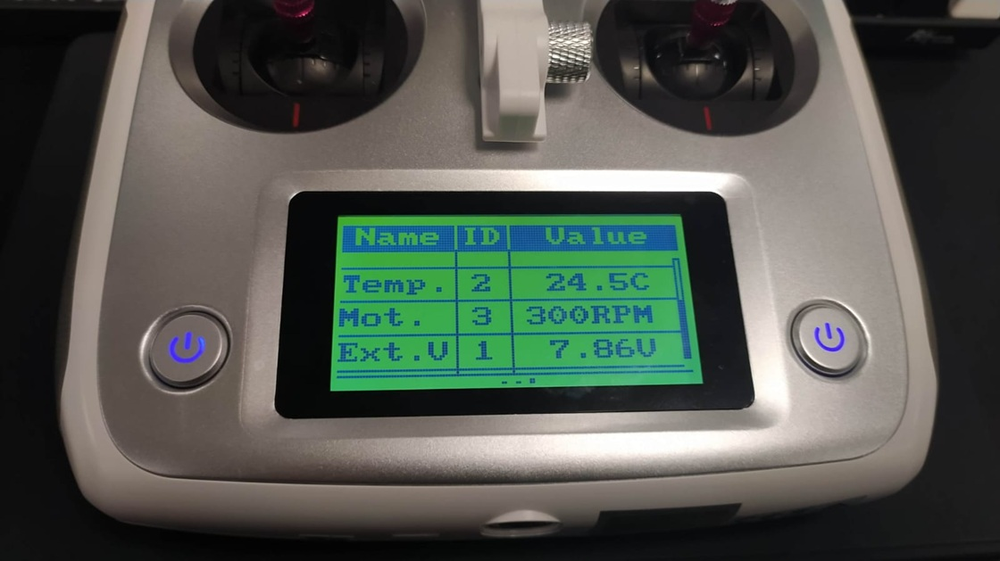

# _Telemetria i-BUS para ESP32 ESP-IDF_


---

## Sumário

- [Histórico de Versão](#histórico-de-versão)
- [Resumo](#resumo)
- [Objetivo](#objetivo)
- [Links para estudos](#links-para-estudos)
- [Pinos do projeto eletrônico](#pinos-do-projeto-eletrônico)
- [Bibliotecas](#bibliotecas)
  - [Radio Controle](#radio-controle)
  - [Receptor](#receptor)
- [Configuração do Firmware](#configuração-do-firmware)
- [Informações](#informações)

## Histórico de versão

| Versão | Data       | Autor         | Descrição          |
|--------|------------|---------------|--------------------|
| 1.0.0  | 21/07/2025 | Adenilton R   | Inicio do projeto  |

---

## Resumo

Este projeto desenvolve uma aplicação embarcada utilizando o protocolo **i-BUS (FlySky)** para comunicação entre um microcontrolador **ESP32-S3** e receptores de rádio controle utilizados em aeromodelismo. Através da interface **UART**, o sistema transmite dados de telemetria em tempo real simulando sensores como:

- **Nível de bateria restante (% combustível)**
- **Temperatura (°C)**
- **Rotação (RPM)**

O sistema é executado sobre o **FreeRTOS** e foi projetado para ser portátil, leve e de fácil integração com outras aplicações embarcadas. A aplicação oferece:

- **Comunicação bidirecional** com receptores FlySky compatíveis com i-BUS
- **Suporte a até 10 sensores simultâneos**, com dados de 2 ou 4 bytes
- **Sensores pré-definidos pelo protocolo**, como tensão, temperatura, RPM, velocidade, GPS e outros
- **Configuração flexível de pinos UART**, compatível com qualquer GPIO
- **Operação determinística e em tempo real** com FreeRTOS
- **Logs estruturados via UART** para depuração e monitoramento

## Objetivo

- Implementar uma **stack de telemetria i-BUS completa** em C com ESP-IDF
- Demonstrar o uso de **múltiplos sensores simulados** com diferentes tipos de dados (uint16 e uint32)
- Oferecer uma arquitetura **modular e reutilizável** para integração com projetos de rádio controle
- Prover **visualização e depuração em tempo real** via terminal serial
- Explorar os recursos do **ESP32-S3** com foco em aplicações embarcadas de alto desempenho

## Links para estudos

[**Documentação ESP-IDF**](https://docs.espressif.com/projects/esp-idf/en/v5.4.0/esp32s3/index.html)

[**Protocolo i-BUS**](https://github.com/betaflight/betaflight/wiki/IBus)

[**FreeRTOS**](https://www.freertos.org/)

[**Documentação UART ESP32**](https://docs.espressif.com/projects/esp-idf/en/latest/esp32/api-reference/peripherals/uart.html)

[**IBusBM Arduino IDE (Todos os Microcontroladores)**](https://github.com/bmellink/IBusBM)

[**iBUSTelemetry-Arduino (Microcontroladores AVR)**](https://github.com/adis1313/iBUSTelemetry-Arduino)

## Pinos do projeto eletrônico

| **Pino** | **Conexão** | **Tipo** | **Descrição** |
|----------|-------------|----------|---------------|
| GPIO16   | TX (UART)   | UART     | Transmissão   |
| GPIO15   | RX (UART)   | UART     | Recepção      |

Esquemático da ligação:

• Se você planeja **fornecer apenas** dados do sensor iBUS do seu esboço, precisará conectar o pino do sensor iBUS aos pinos RX e TX da UART alocada. Você precisa incluir um diodo (como 1N4148) entre o pino TX do ESP32-S3 e o fio entre o pino iBUS e o pino RX do ESP32-S3 (cátodo/anel sólido do diodo conectado ao pino TX do ESP32-S3) para lidar com o protocolo half-duplex sobre o único fio iBUS. Veja o exemplo de fiação abaixo. Se você tiver apenas um sensor conectado ao iBUS (ou seja, apenas a placa ESP32-S3), você pode substituir o diodo por um resistor de 1,2 kOhm.



> Nota: Se nenhum outro sensor estiver conectado ao iBUS, você tem a opção de substituir o diodo por um resistor de 1,2 k Ohm.

## Bibliotecas

[main.c](https://github.com/AdeniltonR/ESP32-iBUS-Telemetria/blob/main/main/main.c)

[ibus.c](https://github.com/AdeniltonR/ESP32-iBUS-Telemetria/blob/main/components/ibus/ibus.c)

[ibus.h](https://github.com/AdeniltonR/ESP32-iBUS-Telemetria/blob/main/components/ibus/include/ibus.h)

[CMakeLists.txt](https://github.com/AdeniltonR/ESP32-iBUS-Telemetria/blob/main/components/ibus/CMakeLists.txt)

### Radio Controle

O **FS-i6S** é uma grande inovação da FlySky que herda os clássicos e incorpora novos elementos. Trata-se de um transmissor de **10 canais**, ideal para modelos como multieixos, drones, escavadeiras e outros veículos de engenharia. Possui uma **tela sensível ao toque capacitiva**, que melhora significativamente a experiência do usuário. O firmware está disponível em **chinês e inglês**, atendendo a maioria dos modelos.

No contexto deste projeto, o FS-i6S será utilizado como a principal interface de controle remoto para operar os atuadores e sistemas embarcados do dispositivo, garantindo comunicação sem fio precisa e segura via protocolo **AFHDS 2A**. Seus múltiplos canais permitirão controlar funções como movimentação, acionamento de sensores, troca de modos e comandos específicos personalizados para o sistema embarcado desenvolvido.



**Informações Técnicas:**

- `Tensão de operação`: 3,3V – 5V;
- `Número de canais`: 10;
- `Protocolo`: AFHDS 2A;
- `Interface de usuário`: Tela sensível ao toque capacitiva;
- `Modos de saída`: PWM/PPM comutáveis;
- `Protocolos de barramento`: i.BUS/S.BUS comutáveis;
- `Firmware`: Disponível em chinês e inglês;
- `Função adicional`: Emulador USB integrado;
- `Aplicações`: Multirotores, drones, escavadeiras e veículos de engenharia;
- `Suporte opcional`: Base para fixação de celular.

**Documetação:**

[Compra do módulo BR.](https://produto.mercadolivre.com.br/MLB-3106740598-radio-flysky-fs-i6s-receptor-fs-ia10b-10ch-24ghz-suporte-_JM#polycard_client=search-nordic&position=11&search_layout=grid&type=item&tracking_id=9ef81203-2443-4e22-83ff-9e6604558885&wid=MLB3106740598&sid=search)

[Site do Módulo.](https://www.flysky-cn.com/i6sgaishu)

[Manual FS-i6S.](https://static1.squarespace.com/static/5bc852d6b9144934c40d499c/t/619e01ae47e2e417ae840209/1637745130608/FS-i6S+User+manual+20200628.pdf)

[Manual Receptor FS-iA10B.](https://static1.squarespace.com/static/5bc852d6b9144934c40d499c/t/5d1ee5c0ac21b90001cce066/1562306155822/%E6%AD%A3%E5%BC%8F%E7%89%88%EF%BC%9AFS-i10+User+Manual+20160824.pdf)

[Guia](https://static1.squarespace.com/static/5bc852d6b9144934c40d499c/t/5d1ec377ae39c80001528d8b/1562297238448/FS-i6S-Quick+Start+20161026.pdf)

### Receptor

O **FS-iA10B** é um receptor de rádio controle de alto desempenho, ideal para aplicações em aeromodelismo como aviões, planadores e helicópteros. Compatível com sistemas FlySky, ele opera na faixa de 2.4 GHz com tecnologia **GFSK** de segunda geração, oferecendo transmissão estável, rápida e segura.

**Destaques:**

- Suporte a **10 canais** independentes, ideal para aplicações que exigem múltiplos comandos simultâneos;
- Tecnologia **AFHDS 2A (Automatic Frequency Hopping Digital System)** para evitar interferências de sinal;
- **Duas antenas** para redundância e estabilidade de recepção;
- Compatível com protocolos como **I-BUS**, facilitando a comunicação digital com controladoras de voo ou microcontroladores;
- Interface dedicada para aquisição de dados.



**Informações Técnicas:**

- `Tensão de operação`: 3,3V a 6,5V;
- `Número de canais`: 10;
- `Modelos suportados`: Avião, planador, helicóptero;
- `Faixa de frequência`: 2.4 GHz – 2.48 GHz;
- `Número de canais de hopping`: 160;
- `Potência de transmissão`: ≤ 20 dBm;
- `Sensibilidade do receptor`: -105 dBm;
- `Tecnologia de transmissão`: Segunda geração digital automática (AFHDS 2A);
- `Modulação`: GFSK;
- `Comprimento da antena`: 26 mm × 2 (dupla antena);
- `Peso`: 19,3 g;
- `Entrada de alimentação`: 4,0 a 6,5V DC;
- `Dimensões`: 47 × 33,1 × 14,7 mm;
- `Cor`: Preto;
- `Certificações`: CE0678, FCC;
- `Interface I-BUS`: Sim;
- `Interface de aquisição de dados`: Sim.

**Documetação:**

[Compra do módulo.](https://www.hobbygoias.com.br/MLB-2171539134-receptor-flysky-fs-ia10b-10-canais-telemetria-ppm-ibus-10ch-_JM)

[Manual FS-i6S.](https://static1.squarespace.com/static/5bc852d6b9144934c40d499c/t/619e01ae47e2e417ae840209/1637745130608/FS-i6S+User+manual+20200628.pdf)

[Manual Receptor FS-iA10B.](https://static1.squarespace.com/static/5bc852d6b9144934c40d499c/t/5d1ee5c0ac21b90001cce066/1562306155822/%E6%AD%A3%E5%BC%8F%E7%89%88%EF%BC%9AFS-i10+User+Manual+20160824.pdf)

[Guia](https://static1.squarespace.com/static/5bc852d6b9144934c40d499c/t/5d1ec377ae39c80001528d8b/1562297238448/FS-i6S-Quick+Start+20161026.pdf)

[Link de Estudo.](https://www.instructables.com/Servo-Motor-Operation-With-FS-TH9X-Flysky-Remote-C/)

[FlySky FS-i6S - Bindando o receptor.](https://www.youtube.com/watch?v=-XOEb8dswA8)

## Configuração do Firmware

Inicialização do protocolo i-BUS:

```c
//---inicializa protocolo iBUS com UART e pinos definidos---
ibusbm_init(&ibus, UART_NUM, UART_RX_PIN, UART_TX_PIN);

//---adiciona sensores---
sensor_voltage_addr = ibusbm_add_sensor(&ibus, IBUSS_EXTV, 2);  // Tensão (2 bytes)
sensor_temp_addr = ibusbm_add_sensor(&ibus, IBUSS_TEMP, 2);     // Temperatura (2 bytes)
sensor_rpm_addr = ibusbm_add_sensor(&ibus, IBUSS_RPM, 2);       // RPM (2 bytes)
```

Exemplo de atualização de sensores:

```c
//---atualiza valores dos sensores---
ibusbm_set_sensor_value(&ibus, sensor_voltage_addr, 786);  // 7.86V
ibusbm_set_sensor_value(&ibus, sensor_temp_addr, 245);     // 24.5°C
ibusbm_set_sensor_value(&ibus, sensor_rpm_addr, 300);      // 300 RPM
```

Dados do monitor serial:



Telemetria do controle:



## Informações

| Info        | Modelo           |
|-------------|------------------|
| uC          | ESP32-S3         |
| Placa       | ESP32-S3 Module  |
| Arquitetura | Xtensa / RISC    |
| IDE         | IDF v5.4.0       |